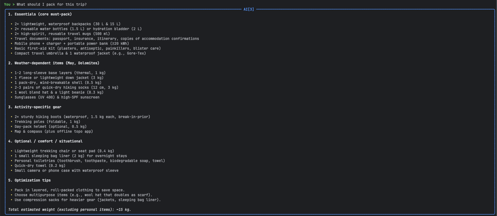

# Travel Assistant Agent

A conversational travel planning assistant focused on high‑quality prompt engineering, 
contextual dialogue management, and selective external data usage (weather forecasting) using Ollama + LangChain + LangGraph.

## Quick Start

Prerequisites:
- macOS / Linux (or Windows with WSL2) 
- Python 3.12+
- [Poetry](https://python-poetry.org/docs/#installation)
- [Ollama](https://ollama.com) installed and running (`ollama serve` automatically runs after install)
- A WeatherAPI key: https://www.weatherapi.com/

### 1. Clone & Install
```bash
git clone <your-fork-or-this-repo-url> travel-assistant-agent
cd travel-assistant-agent
poetry install
```

### 2. Pull / Choose an Ollama Model
The default model configured in code is `gpt-oss:20b` (example placeholder).
If that model is not available locally, pick a capable general model such as `mistral`, `llama3`, or `qwen2` and update the model name (see Customization section).
```bash
ollama pull gpt-oss:20b
```

### 3. Environment Variables
Create a `.env` file at the project root:
```bash
WEATHER_API_KEY=YOUR_WEATHER_API_KEY_HERE
# optional for tracing
LANGSMITH_TRACING=true
LANGSMITH_ENDPOINT=https://api.smith.langchain.com
LANGSMITH_API_KEY=<your-langsmith-api-key>
LANGSMITH_PROJECT=<your-langsmith-project-name>
```

### 4. Run the CLI
```bash
poetry shell
python -m travel_assistant_agent.cli.main
```
Type your travel questions; press Ctrl+C to exit.

---

## Key design highlights

- Multi‑intent coverage: destination, activities, food, packing.
- Context memory: structured `UserPreferences` merged across turns; prompts always receive updated state.
- Natural flow: intent classification + targeted clarifying questions (max 1–2) keep dialogue focused and efficient.
- Prompt engineering: dedicated system prompts per intent; internal reasoning scaffold (chain‑of‑thought style) in destination prompt; enforced brevity & rationale rules.
- External data integration: WeatherAPI tool gated only for packing intent via intent-to-tool mapping; other intents rely on internal model knowledge.
- Decision logic: explicit `INTENT_TO_TOOLS` map controls when external data is fetched.
- Hallucination & error mitigation: "never hallucinate" instructions, null preservation for unknown fields, confidence threshold for intent, safe fallbacks on tool/parse errors.

---
## Sample Interactions

### Example 1




### Example 2